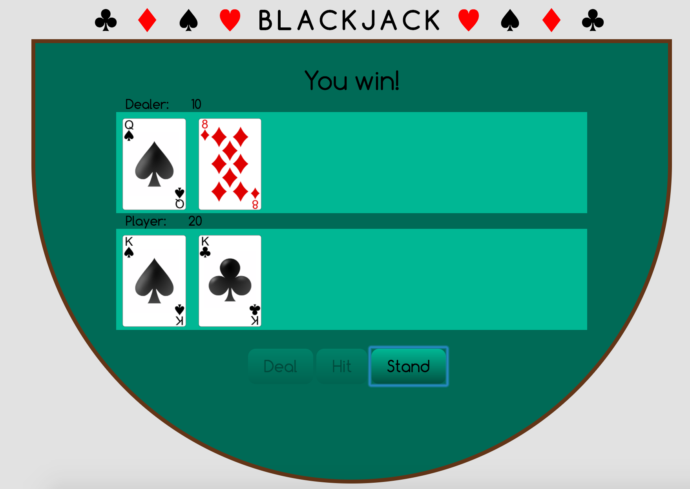
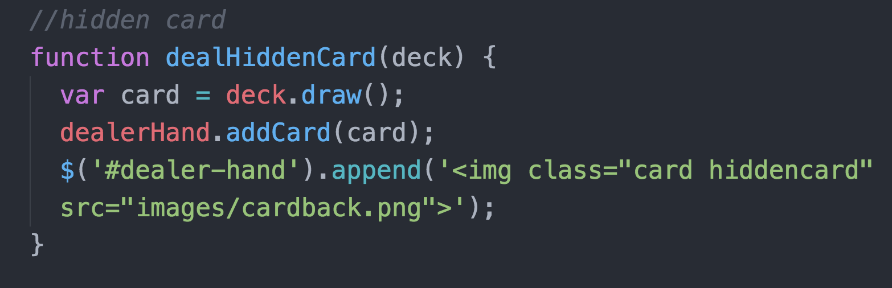
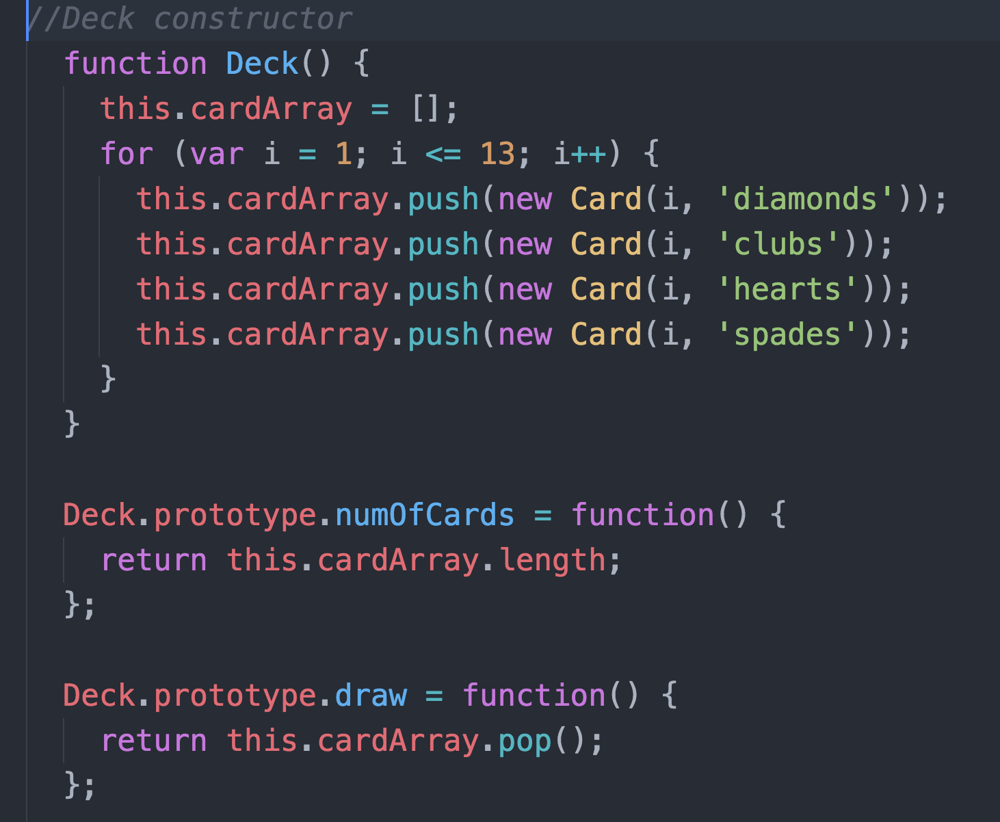
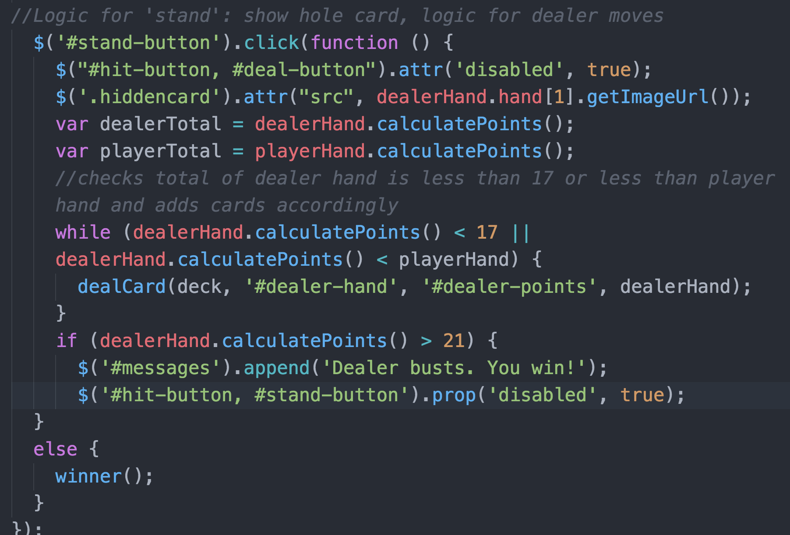

#Blackjack

**Live Demo:** http://blackjack.surge.sh/blackjack.html

##Criteria
  * Use constructors to create the deck, card, and player/dealer hands
  * Shuffle the deck
  * Deal to the player and dealer, but do not reveal the hole card until the player stands
  * Calculate and display points 
  * Determine the outcome and display the message  
  
 
**Win message displayed**  

 
**Adds card with value to dealer's hand array, but displays the back of the card**  

 
**Deck constructor**  

 
**Logic implemented on clicking the stand button**  

##Stretch Goals 
  * Restart the game with a 'play again' button 
  * Play the game with additional decks 
  * Add a betting system
