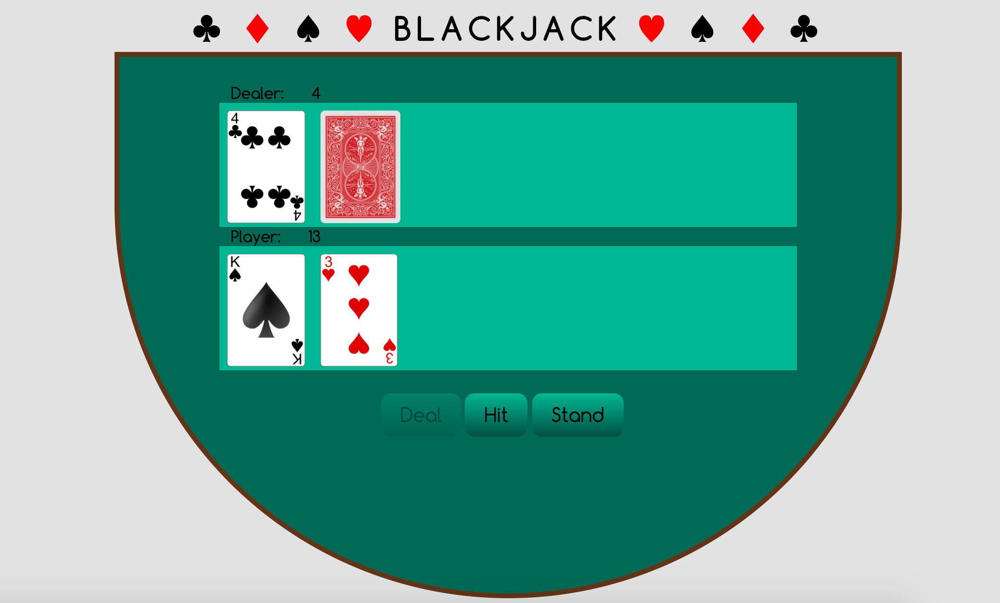

#Blackjack

Live Demo: http://blackjack.surge.sh/blackjack.html

##Criteria
  * Use constructors to create the deck, card, and player/dealer hands
  * Shuffle the deck
  * Deal to the player and dealer, but do not reveal the hole card until the player stands
  * Calculate and display points 
  * Determine the outcome and display the message 
  
##Stretch Goals 
  * Restart the game with a 'play again' button 
  * Play the game with additional decks 
  * Add a betting system
